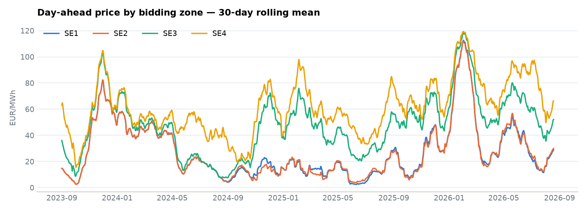
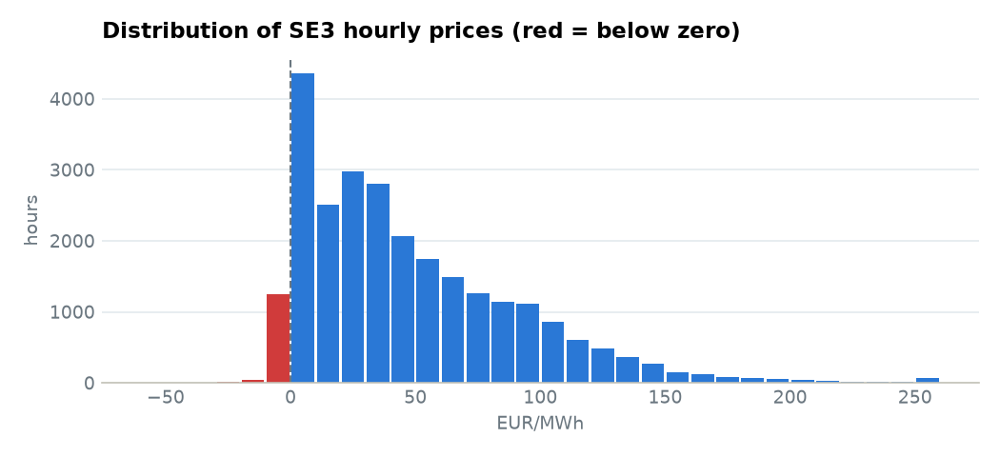
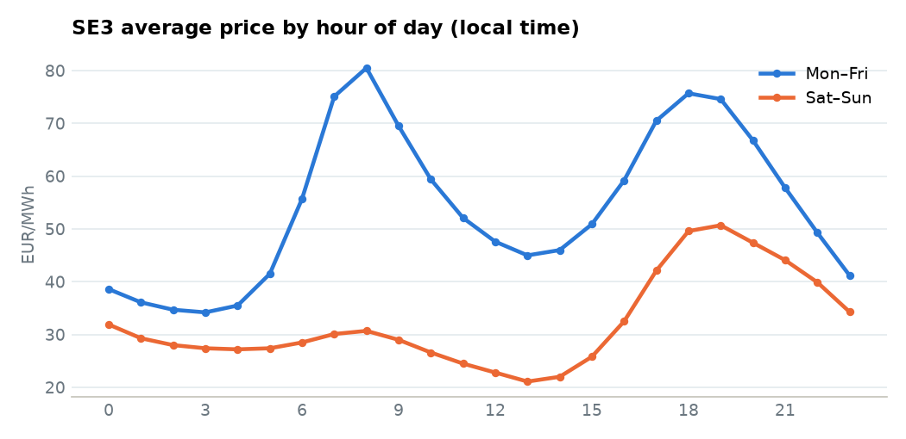
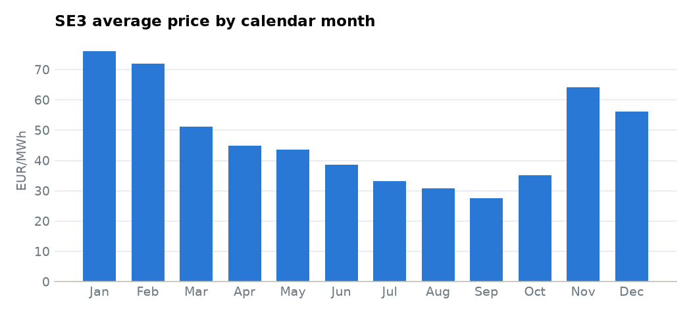
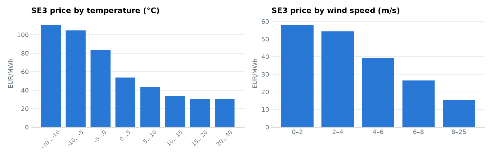
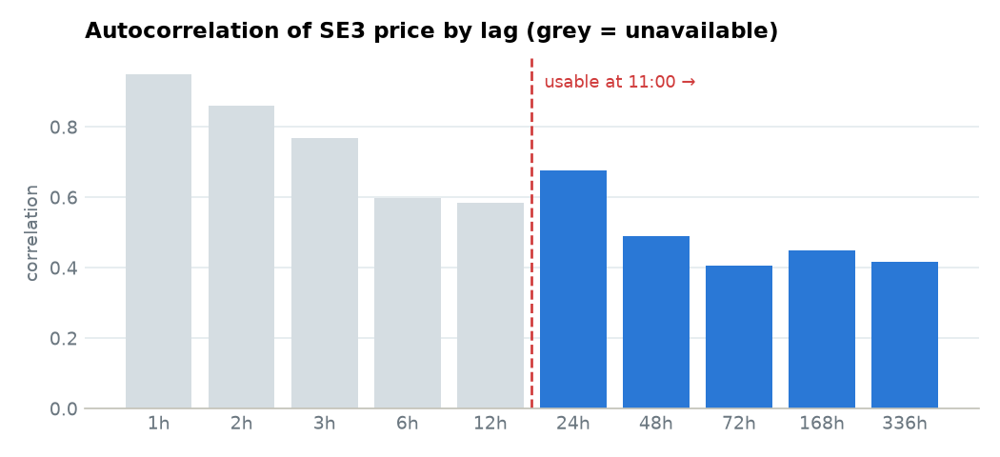

# Stage 3 — Exploratory Data Analysis

Reproduce with `PYTHONPATH=. python notebooks/03_eda.py`, which writes `reports/eda_data.json`
and the figures below to `reports/figures/`. This document is the canonical report;
`reports/03_eda.html` is an interactive rendering of the same numbers.

Scope: 26,013 hourly observations, 2023-09-01 → 2026-08-19, bidding areas SE1–SE4,
plus six SMHI weather parameters per area. Target for Stage 5 is **SE3**.

## Method note

Prices are stored at native resolution (60-minute before 2025-10-01, 15-minute after),
so EDA averages sub-hourly periods into their UTC hour. That is adequate for
distributional work but **not** the final rule — see "Carried into Stage 4" below.

## 1. Data quality

| Check | Result |
|---|---|
| Duplicate keys (time × area) | 0 in all three tables |
| Null prices | 0 |
| Days with unexpected period counts | all explained by DST (23/25-hour days) |
| Resolution change | exactly 2025-10-01, as documented |
| Overlapping delivery periods | **3 days** — see below |

**The one real defect.** On the three DST fall-back Sundays (2023-10-29, 2024-10-27,
2025-10-26) the source publishes overlapping periods: a long period covering the
repeated local hour *plus* a separate period for the second instance of it. On
2023-10-29 SE3 the 120-minute period 00:00–02:00 UTC overlaps the 60-minute period
01:00–02:00 UTC, and the two carry different prices (25.34 vs 22.35 EUR/MWh). The
day totals 1560 minutes where a 25-hour day is 1500.

Affected: 4 overlapping pairs on each of the two hourly years, 16 on the 15-minute
year. 0.3% of days — but a naive hourly aggregation silently blends two prices for
one hour, and a naive expansion duplicates the hour outright.

Weather completeness is good, with a few gaps worth knowing: `precipitation_se3`
13.1% missing, `pressure_se4` 11.0%, `humidity_se3` 9.0%; everything else under 5%.

## 2. Price levels and the area structure

| Area | Mean | Median | 5th | 95th | Min | Max | % negative |
|---|---|---|---|---|---|---|---|
| SE1 | 27.6 | 14.5 | 0.0 | 100.2 | −74.1 | 526.2 | 5.6% |
| SE2 | 27.5 | 13.8 | −0.3 | 100.4 | −60.0 | 526.2 | 6.7% |
| SE3 | 47.8 | 36.4 | 0.0 | 129.9 | −60.0 | 707.5 | 5.1% |
| SE4 | 61.4 | 54.2 | 0.0 | 150.0 | −60.0 | 699.1 | 5.2% |

The north–south gradient is the dominant structural fact: SE4 averages 2.2× SE1.
The SE4−SE1 spread is positive in 66.3% of hours, mean 33.8, max 684.

Correlations split the country into two blocks:

```
        SE1     SE2     SE3     SE4
SE1   1.000   0.987   0.697   0.517
SE2   0.987   1.000   0.684   0.503
SE3   0.697   0.684   1.000   0.876
SE4   0.517   0.503   0.876   1.000
```

SE1/SE2 are nearly the same series (r = 0.987). For SE3, the informative neighbours
are **SE4 (0.876)** and, more weakly and therefore more independently, **SE1 (0.697)**.



The northern pair track each other almost exactly; the southern pair sit above them for most
of the record. Each winter is a distinct peak.



The target is heavily right-skewed — median 36.4 against a mean of 47.8 — and 5.1% of hours
are priced below zero, which rules out a log transform.

## 3. Temporal structure

- **Hour of day.** Double peak: 08:00 (66.2) and 18:00 (68.3), trough 03:00 (32.2).
  Weekends lose the morning peak almost entirely — it is industrial/commuting load.
- **Day of week.** Tue 58.2 highest, Sun 31.8 lowest. Weekend ≈ 58% of a weekday.
- **Month.** Jan 76.0 → Sep 27.5, a 2.5× annual swing.





## 4. Weather relationships

Both physical drivers behave monotonically:

| SE3 temperature | mean price | | SE3 wind speed | mean price |
|---|---|---|---|---|
| −30…−10 °C | 110.6 | | 0–2 m/s | 58.0 |
| −5…0 °C | 83.6 | | 4–6 m/s | 39.3 |
| 10…15 °C | 33.9 | | 8+ m/s | 15.4 |
| 20…40 °C | 30.3 | | | |

Correlations with SE3 price: `air_temperature_se3` −0.418, `wind_speed_se1` −0.260,
`wind_speed_se3` −0.239, `air_pressure_se1` +0.281.



Two findings worth carrying forward:

1. **Northern wind beats local wind.** `wind_speed_se1` (−0.260) predicts SE3's price
   better than `wind_speed_se3` (−0.239), because Swedish wind capacity is
   concentrated in the north. Do not assume the local station is the relevant one.
2. **Pressure is a usable proxy.** `air_pressure_se1` at +0.281 is a stronger single
   correlate than local wind speed — high pressure means calm, still, cold.

## 5. Lag structure — and the leakage boundary

| lag | 1h | 2h | 6h | 12h | 24h | 48h | 72h | 168h | 336h |
|---|---|---|---|---|---|---|---|---|---|
| r | 0.949 | 0.860 | 0.628 | 0.612 | **0.677** | 0.489 | 0.427 | **0.450** | 0.416 |

The strongest autocorrelation is at short lags — and all of it is **unusable**. The
forecast is made ~11:00 on day D for all 24 hours of day D+1, so the shortest
legitimately available lag is 24 hours.

Note that r rises from 12h (0.612) to 24h (0.677) and again at 168h (0.450 vs 0.427
at 72h): the daily and weekly cycles reassert themselves. The one-week lag is
therefore worth including even though it sits further back than the two-day lag.



Grey bars are lags shorter than 24 hours: strongly correlated, but unavailable at the 11:00
forecast time and therefore unusable.

## Carried into Stage 4

1. **Resolve the DST overlap explicitly.** Expand periods onto an hourly UTC grid and,
   where a slot is covered twice, prefer the shorter (more specific) period. Assert
   afterwards that every (hour, area) key is unique.
2. **Settle the resolution change.** Decide one rule — probably mean of the four
   15-minute periods within each hour — and apply it uniformly across the record.
3. **Features:** lags at t−24h, t−48h, t−168h for SE3 and for SE4/SE1; cyclical
   encodings of hour/day-of-week/month; temperature and wind including northern wind;
   pressure.
4. **Target handling:** 5% of hours are negative, so no log transform. The heavy right
   tail argues for reporting MAE alongside RMSE.
5. **Leakage discipline:** no feature may use information after ~11:00 on day D. Weather
   is trained on observations but production would need forecasts — state this as a
   known limitation, as the reference platform's own MET-forecast pipeline exists for exactly this.
